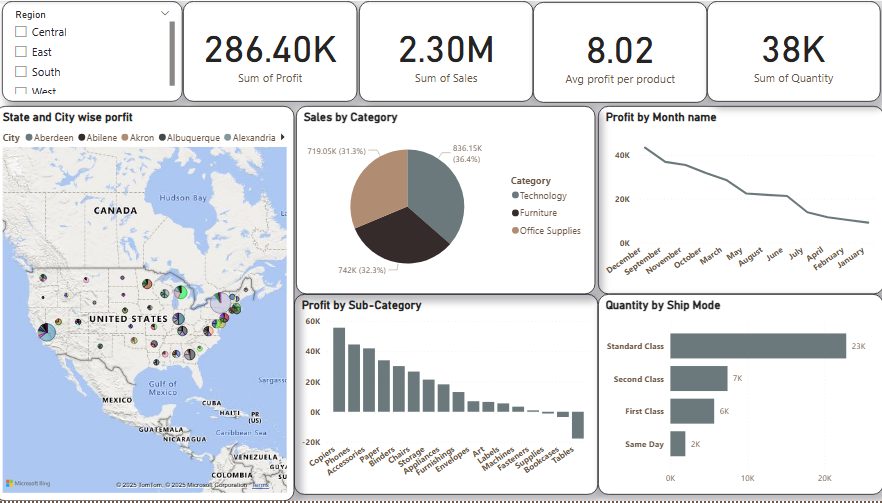

# 📊 Power BI Dashboard - Sales & Profit Analysis

This project showcases an interactive Power BI dashboard for analyzing sales and profit performance across regions, categories, and time. The dashboard provides actionable insights using visualizations such as bar charts, pie charts, maps, and KPI cards.

## 🚀 Overview

This dashboard enables business users and decision-makers to:

- Monitor total sales, profit, quantity, and average profit per product.
- Analyze sales distribution by **Category** and **Sub-Category**.
- Track **Monthly Profit Trends**.
- Understand **regional and city-level profitability**.
- Evaluate **shipping modes** and their impact on product movement.

## 📸 Dashboard Preview

## 📂 Dataset

The dataset used includes the following key fields:

- **Region**
- **State**
- **City**
- **Category**
- **Sub-Category**
- **Sales**
- **Profit**
- **Quantity**
- **Ship Mode**
- **Order Date**

> Note: The dataset used in this dashboard is inspired by the Superstore sales dataset.

## 📈 Key Visuals & Features

- 💰 **KPI Cards** – Total Sales, Profit, Quantity, and Avg. Profit per Product
- 🗺️ **Map Visualization** – Profit distribution by state and city
- 🧩 **Pie Chart** – Sales by Category (Furniture, Technology, Office Supplies)
- 📉 **Line Chart** – Monthly profit trends
- 📊 **Bar Charts**:
  - Profit by Sub-Category
  - Quantity by Ship Mode
- 🧭 **Region Filter** – Interact and drill down by Central, East, West, and South

## 📦 Tools Used

- **Power BI Desktop**
- **DAX** for calculated fields
- **Power Query** for data transformation
